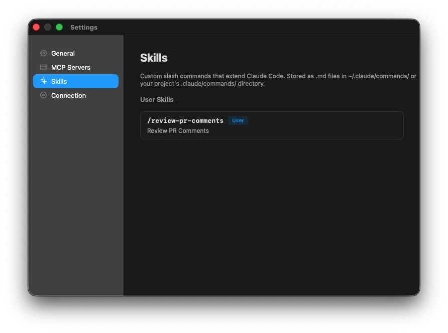

# Shire

[](https://github.com/celeroncoder/shire/actions/workflows/release.yml)

A native macOS app that turns any folder into an AI-powered workspace, backed by [Claude Code](https://docs.anthropic.com/en/docs/claude-code).

## Screenshots

| Chat | Workspace |
|------|-----------|
|  |  |

| Settings — Connection | Settings — Skills |
|-----------------------|-------------------|
|  |  |

## Prerequisites

1. **Xcode 15+** — install from the Mac App Store
2. **Claude Code** — install via one of:
   ```bash
   brew install claude-code
   ```
   or
   ```bash
   npm install -g @anthropic-ai/claude-code
   ```
3. **XcodeGen** (for project generation only):
   ```bash
   brew install xcodegen
   ```

Make sure Xcode is selected as the active developer directory:

```bash
sudo xcode-select -s /Applications/Xcode.app/Contents/Developer
```

## Quickstart

### 1. Generate the Xcode project

```bash
cd apps/macos
xcodegen generate
```

This creates `Shire.xcodeproj` from `project.yml` and resolves SPM dependencies (GRDB.swift, swift-markdown).

### 2. Open in Xcode

```bash
open apps/macos/Shire.xcodeproj
```

Then press **Cmd+R** to build and run.

### 3. Build from the command line

```bash
xcodebuild -project apps/macos/Shire.xcodeproj \
  -scheme Shire \
  -configuration Debug \
  build
```

### 4. Run the built app

```bash
open ~/Library/Developer/Xcode/DerivedData/Shire-*/Build/Products/Debug/Shire.app
```

Or with a custom derived data path:

```bash
xcodebuild -project apps/macos/Shire.xcodeproj \
  -scheme Shire \
  -configuration Debug \
  -derivedDataPath apps/macos/DerivedData \
  build

open apps/macos/DerivedData/Build/Products/Debug/Shire.app
```

## How It Works

Shire is a native UI layer over Claude Code. It does not bundle its own AI agent or tools.

1. **Create a workspace** — point Shire at any folder on your machine
2. **Start a chat** — type a message and Shire spawns a Claude Code subprocess
3. **Claude Code does the work** — file reading, writing, search, shell execution, all handled by Claude Code
4. **Multi-turn conversations** — each session uses `--resume` for seamless follow-ups

### Claude Code Discovery

Shire finds the `claude` binary automatically:

1. User override (Settings > Advanced > Claude Code path)
2. `/opt/homebrew/bin/claude` (Apple Silicon Homebrew)
3. `/usr/local/bin/claude` (Intel Homebrew)
4. `which claude` (general PATH lookup)

If not found, the Settings page shows an install prompt.

## Project Structure

```
shire/
├── apps/
│   ├── macos/                  # Native macOS app (AppKit)
│   │   ├── project.yml         # XcodeGen spec
│   │   ├── Shire.xcodeproj/    # Generated Xcode project
│   │   └── Shire/
│   │       ├── App/            # AppDelegate, MainMenu
│   │       ├── Windows/        # MainWindowController
│   │       ├── ViewControllers/# Split, Sidebar, Content, Chat, Settings
│   │       ├── Views/          # MessageCell, ToolCallCell, Composer, Markdown
│   │       ├── Models/         # Workspace, Session, Message, Artifact
│   │       ├── Database/       # GRDB manager, schema, repositories
│   │       ├── ClaudeCode/     # Binary discovery, subprocess, NDJSON parser
│   │       ├── Services/       # Chat, Workspace, Settings orchestration
│   │       └── Utilities/      # UUIDv7, theme colors
│   │
│   └── landing/                # Marketing page (Vite + React)
│
├── PROPOSAL.md
├── README.md
└── package.json
```

## Tech Stack

| Layer | Technology |
|---|---|
| Language | Swift 5.9+ |
| UI | AppKit (NSWindow, NSSplitViewController, NSOutlineView, NSTableView) |
| Database | SQLite via GRDB.swift |
| AI | Claude Code CLI (subprocess) |
| Markdown | swift-markdown → NSAttributedString |
| Build | Xcode 15+ / Swift Package Manager |
| Target | macOS 13.0+ (Ventura) |

## Keyboard Shortcuts

| Shortcut | Action |
|---|---|
| Cmd+N | New session |
| Cmd+Shift+N | New workspace (folder picker) |
| Cmd+, | Settings |
| Enter | Send message |
| Shift+Enter | Insert newline |
| Cmd+W | Close window |

## Settings

Configured in the app's Settings panel:

| Setting | Description |
|---|---|
| Model | sonnet / opus / haiku |
| Max Budget | Per-message spend limit (USD) |
| System Prompt | Appended to Claude Code's system prompt |
| Claude Code Path | Override auto-detected binary path |

## Database

SQLite database stored at `~/Library/Application Support/Shire/shire.db`. Migrations run automatically on app launch.

Tables: `workspaces`, `sessions`, `messages`, `artifacts`, `settings`.

## Landing Page

The marketing page is a separate Vite + React app:

```bash
cd apps/landing
bun install
bun dev
```
